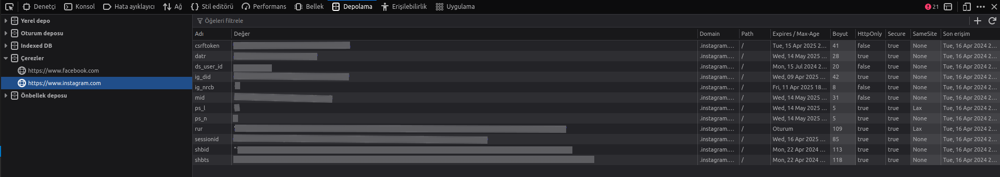

<a name="readme-top"></a>


<!-- PROJECT SHIELDS -->
[![Contributors][contributors-shield]][contributors-url]
[![Forks][forks-shield]][forks-url]
[![Stargazers][stars-shield]][stars-url]
[![Issues][issues-shield]][issues-url]
[![MIT License][license-shield]][license-url]

<div align="center">
  <a href="">
    
  </a>
<br/><br/>
<h1 align="center">Download your Saved Posts on Instagram</h1>
  <p align="center">
    This project contains a set of Python script using the Instaloader library that allows Instagram users to easily download their saved posts on the platform. This project allows users to store their favorite content on Instagram on their PC and access it whenever needed. By storing posts they like or are interested in offline, users can always have special moments or inspiring content with them.
    <br/><br/>
    ·
    <a href="https://github.com/kivancakcil/DownloadInstagramSavedPosts/issues/new?labels=bug&template=bug-report---.md">Report Bug</a>
    ·
    <a href="https://github.com/kivancakcil/DownloadInstagramSavedPosts/issues/new?labels=enhancement&template=feature-request---.md">Request Feature</a>
  </p>
</div>
<br/>


<!-- TABLE OF CONTENTS -->
<details>
  <summary>Table of Contents</summary>
  <ol>
    <li><a href="#about-the-project">About The Project</a></li>
    <li><a href="#getting-started">Getting Started</a>
    <ul>
      <li><a href="#how-to-get-session-id-and-csfr-token">How to Get Session ID and CSFR Token</a></li>
    </ul>
    </li>
    <li><a href="#usage">Usage</a>
    <ul>
      <li><a href="#important-facts-about-the-process">Important Facts About the Process</a></li>
    </ul>
    <ul>
      <li><a href="#after-the-process">After the Process</a></li>
    </ul>
    </li>
    <li><a href="#contributing">Contributing</a></li>
    <li><a href="#license">License</a></li>
    <li><a href="#contact">Contact</a></li>
    <li><a href="#acknowledgements">Acknowledgements</a></li>
    <li><a href="#💰-you-can-support-me-with-your-donations">Donation</a></li>
  </ol>
</details>


<!-- ABOUT THE PROJECT -->
## About The Project

The project generally consists of 2 Python files. One is `saved_posts.py` where we download our saved posts, the other is `handle_garbages.py` where we first delete unnecessary .txt and .json files and then parse mostly unnecessary videos / reels templates.


<!-- GETTING STARTED -->
## Getting Started

First of all, let's install the Instaloader library we need by running the following code from the terminal.

```powershell
pip install instaloader
```

Then come to our `saved_posts.py` file and fill in *username*, *password*, **session_id** and **CSFR Token**.

### How to Get Session ID and CSFR Token

* ***Log in to Instagram***: Log in to Instagram in your browser with your username and password.

* ***Open Developer Tools***: In most web browsers, you can access developer tools by right-clicking on a web page and selecting "Inspect" or "Inspect Item". Alternatively, you can access developer tools by pressing *F12* or *Ctrl+Shift+I*.

* ***Switch to the Application or Storage Tab***: In the developer tools window, there should be a tab named "Application" or "Storage" (the exact name may vary depending on the browser). Click on this tab.

* ***Expand Cookies***: In the Application or Storage tab, you will find a section for "Cookies" on the left edge. Expand this section by clicking on it.

* ***Find Instagram Cookie***: Find the link https://www.instagram.com/ and view cookies by clicking on it.

* ***Find Session ID and CSRF Token***: In the list of cookies you will see a label like "Session ID" or something similar. The session cookie name may vary depending on the website or application you are using. The value of this cookie is your session ID. Similarly, in the list of cookies you will see a label like "CSRF Token" or similar. The value of this cookie is your CSRF (Cross-Site Request Forgery) Token.

<br/>

* After successfully completing all the steps you should be seeing a screen like this:




<!-- USAGE -->
## Usage

After filling in the required fields in `saved_posts.py` file, we run our code.

If you run the script and get an error like `JSON Query to accounts/login/: Could not find "window._sharedData" in html response.` (which you probably will), wait a bit. If after a few minutes it doesn't start pulling all your saves and downloading them as `[1,your_total_number_of_saved_posts]`, there's a mistake somewhere. Please feel free to let me know the error result.

When you run the script you will have a `login_credentials.txt` file. If you need the script again later, it will be quickly reusable with the help of this file.

### Important Facts About the Process

* If your saved posts are more than 1000 (after 1000 I realized it could be even lower) you get a timeout of about 1 minute after downloading 5-10 posts.

* As you would appreciate, I never turned off my computer and I disabled screen lock, so it never went to sleep even when I wasn't at my computer.

* I had about **6500 saved posts in total and it took about 30 hours to download**. The reason for this is, as I said, the timeouts and the individual download requests per post.

### After the Process

* After the download is successfully completed, we come to `handle_garbages.py` file. Here you can delete and extract unnecessary files after entering the necessary folder paths. I explained the details in the code with comment lines, you can review it from there.


<!-- CONTRIBUTING -->
## Contributing

Contributions are what make the open source community such an amazing place to learn, inspire, and create. Any contributions you make are **greatly appreciated**.

If you have a suggestion that would make this better, please fork the repo and create a pull request. You can also simply open an issue with the tag "enhancement".
Don't forget to give the project a <span style=" color: #FFBF00;">**star**</span>! Thanks again!

1. Fork the Project
2. Create your Feature Branch (`git checkout -b feature/AmazingFeature`)
3. Commit your Changes (`git commit -m 'Add some AmazingFeature'`)
4. Push to the Branch (`git push origin feature/AmazingFeature`)
5. Open a Pull Request


<!-- LICENSE -->
## License

Distributed under the MIT License. See `LICENSE.txt` for more information.


<!-- CONTACT -->
## Contact

Kıvanç Akçil - kivancakcil@hotmail.com

[](https://linkedin.com/in/kivancakcil/)


<!-- ACKNOWLEDGEMENTS -->
## Acknowledgements
 * <a href="https://github.com/othneildrew/Best-README-Template">Best README Template</a>

 * <a href="https://github.com/isPique/Instaloader-Scripts">Instaloader Scripts</a>


<!-- DONATE -->
## 💰 You can Support Me with Your Donations

  [](https://buymeacoffee.com/kivancakcil) 

<p align="center">(<a href="#readme-top">Back to Top</a>)</p>


<!-- MARKDOWN LINKS & IMAGES -->
[contributors-shield]: https://img.shields.io/github/contributors/kivancakcil/DownloadInstagramSavedPosts.svg?style=for-the-badge
[contributors-url]: https://github.com/kivancakcil/DownloadInstagramSavedPosts/graphs/contributors
[forks-shield]: https://img.shields.io/github/forks/kivancakcil/DownloadInstagramSavedPosts.svg?style=for-the-badge
[forks-url]: https://github.com/kivancakcil/DownloadInstagramSavedPosts/network/members
[stars-shield]: https://img.shields.io/github/stars/kivancakcil/DownloadInstagramSavedPosts.svg?style=for-the-badge
[stars-url]: https://github.com/kivancakcil/DownloadInstagramSavedPosts/stargazers
[issues-shield]: https://img.shields.io/github/issues/kivancakcil/DownloadInstagramSavedPosts.svg?style=for-the-badge
[issues-url]: https://github.com/kivancakcil/DownloadInstagramSavedPosts/issues
[license-shield]: https://img.shields.io/github/license/kivancakcil/DownloadInstagramSavedPosts.svg?style=for-the-badge
[license-url]: https://github.com/kivancakcil/DownloadInstagramSavedPosts/blob/master/LICENSE.txt